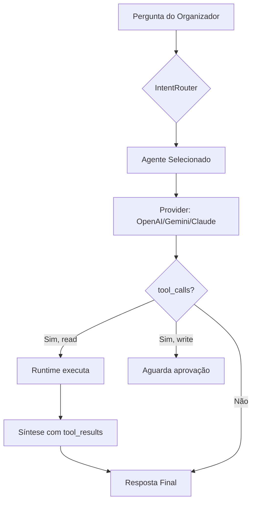
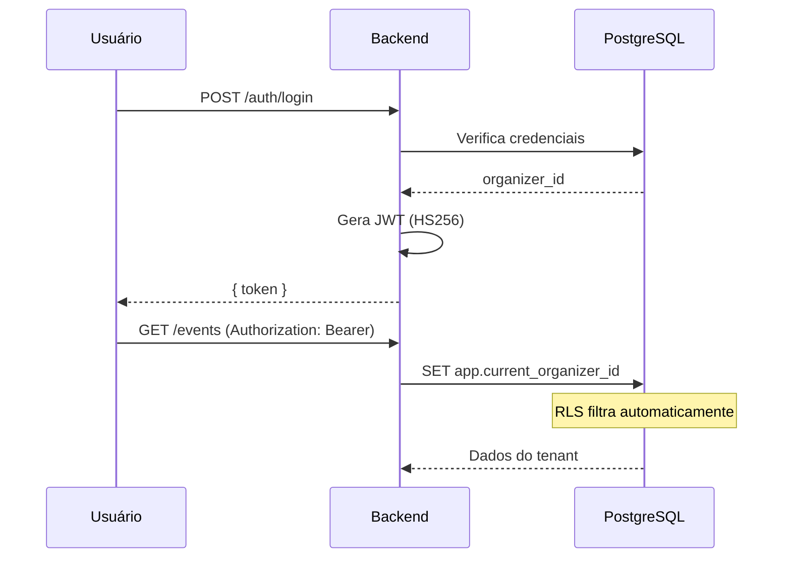

# Mermaid Diagrams — EnjoyFun

## Tipos Mais Usados

### Fluxo de Agente IA

### Sequência de Auth

## Regras
- Incluir em ADRs quando o fluxo tem 3+ passos
- Labels em português na UI, inglês técnico nos nomes internos
- Manter simples — max 15 nós por diagrama
- Usar `flowchart TD` (top-down) como padrão
