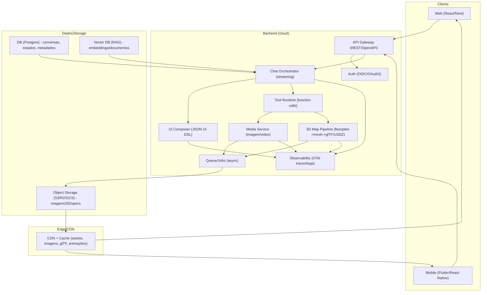
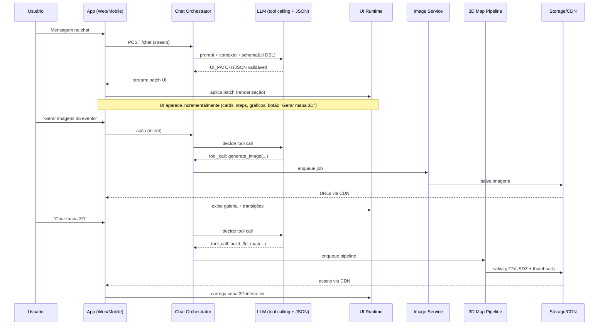

iturn15image4turn15image6turn15image8turn15image14

# Modelo interativo de chat que gera interfaces dinâmicas, imagens e mapas 3D

## Resumo executivo

Você quer replicar (no sentido de **reproduzir o padrão de experiência**, não copiar IP) um modelo de app em que o usuário começa num **chat**, e a IA vai “materializando” a conversa em **interfaces dinâmicas**: telas/fluxos, visualizações interativas, transições/efeitos, geração de imagens do evento e um **mapa 3D da planta baixa**. A abordagem técnica mais robusta hoje é tratar o chat como **orquestrador** e separar o produto em três loops: (1) **loop rápido** de conversa + UI incremental, (2) **loop de geração de mídia** (imagens e animações) e (3) **loop de 3D** (floorplan → 3D → render interativo), com pipelines assíncronos e cache/CDN para manter latência baixa.

O núcleo do sistema deve ser um **“UI Runtime” dirigido por dados**: a IA não “desenha pixels” diretamente; ela entrega um **contrato estruturado** (JSON/JSON Schema) contendo **intenção + layout + componentes + dados + ações**, e o app renderiza isso com um **catálogo fechado** de componentes (design system) e controles de segurança. Isso reduz alucinações e permite governança. Para garantir confiabilidade, use **Structured Outputs / JSON Schema** na camada do LLM (para que a resposta seja validável) e/ou function calling (para ações e patches de UI). citeturn1search8turn1search12turn1search0

Para o mapa 3D de planta baixa, há dois caminhos:  
- **Captura/scan (alta fidelidade)**: em iOS, o **RoomPlan** entrega geometria paramétrica e exporta **USD/USDZ** (ótimo quando você controla o ambiente e tem dispositivos compatíveis). citeturn0search4turn0search12turn15image3  
- **Reconstrução a partir de planta 2D / PDF (mais universal)**: usar visão computacional para vetorizar e estruturar a planta (papers clássicos como *Raster-to-Vector*) e então extrudar paredes/ambientes para 3D (glTF) — combinando com segmentação (ex.: SAM) quando necessário. citeturn7search0turn7search28turn8search3  

No front-end 3D, a decisão central é: **Unity/Unreal** (potência máxima, custo/peso maiores) vs **WebGL/WebGPU** (Three.js/Babylon/PlayCanvas: leve, excelente para web e “embeddable” em app via WebView). Three.js, Babylon.js e PlayCanvas são motores consolidados para 3D no browser; PlayCanvas Engine é open-source MIT e suporta WebGL/WebGPU. citeturn3search0turn3search1turn3search2turn4search3

Em custos, os grandes drivers são: (a) tokens/LLM, (b) geração de imagem e (c) armazenamento + entrega de assets 3D (CDN/egress). Como referência, a precificação de modelos (ex.: GPT-5.4) é por 1M tokens e a família GPT Image tem custo por token e também **preço por imagem** (dependendo de tamanho/qualidade). citeturn12view0turn12view1turn12view2 Também é relevante que endpoints de **data residency / processamento regional** podem ter acréscimo (ex.: +10% para certos modelos) e devem ser considerados para LGPD e políticas internas. citeturn19search0turn19search9turn19search1

Do ponto de vista de compliance (LGPD), a arquitetura deve separar rigorosamente: dados pessoais vs dados de telemetria vs conteúdo/arquivos. A LGPD define conceitos como **controlador, operador, dados pessoais sensíveis, anonimização** etc., e a ANPD tem guias orientativos (agentes de tratamento) e procedimentos de comunicação de incidente. citeturn11search2turn11search5turn11search0

---

## Decomposição técnica do produto

### Experiência alvo em camadas

A experiência “chat → UI viva” normalmente se sustenta em quatro camadas:

Camada de conversação: streaming de tokens, memória curta (janela de contexto), memória longa (eventos, preferências), ferramentas (tool calling), e trilhas de auditoria.

Camada de UI dinâmica: o modelo produz **descrições estruturadas** (ex.: JSON Schema + “uiSchema”/layout) para renderizar formulários, cards, gráficos, steps, mapas, galerias e cenas 3D. Bibliotecas como **JSON Forms** e **react-jsonschema-form** existem justamente para gerar UI a partir de JSON Schema, com custom renderers e regras de visibilidade/validação. citeturn6search0turn6search1turn6search12

Camada de mídia: geração de imagens (eventos, moodboards, convites, banners), edição iterativa e eventualmente variações — com APIs dedicadas (Image API) ou como “ferramenta” dentro de um fluxo conversacional (Responses API). citeturn12view2turn8search0turn8search24

Camada 3D/espacial: pipeline de **(a) aquisição → (b) normalização → (c) conversão para formato runtime → (d) render e interação**. Para runtime multiplataforma, **glTF 2.0** é o “JPEG do 3D” (leve e interoperável) e o ecossistema de export/import é maduro (Blender exporta glTF; Three.js carrega glTF; Unity tem glTFast para runtime import). citeturn0search1turn9search2turn17search3turn9search3

### Planta baixa 3D: estratégias práticas

Para bancos e apps de alta exigência, o melhor resultado vem de combinar **3 estratégias**, escolhidas por contexto:

Estratégia de captura com sensores (quando disponível): RoomPlan (iOS LiDAR) produz representação paramétrica e exporta USD/USDZ, com dimensões/posicionamento de componentes (paredes, portas etc.). É excelente para “scan rápido no local” (ex.: montar evento, feira, showroom). citeturn0search4turn0search12turn15image3

Estratégia de planta 2D → vetores → 3D: o paper *Raster-to-Vector* aborda converter uma planta rasterizada em representação vetorial, e é base para pipelines que depois extrudam paredes e geram “dollhouse” 3D. citeturn7search0turn7search36

Estratégia híbrida com fotos: *Plan2Scene* explora converter planta + fotos em mesh texturizada (mais ambicioso). Pode inspirar fases futuras, mas para produto de banco o caminho “procedural + texturas controladas” costuma ser mais previsível. citeturn7search2turn7search14

### Visualizações interativas e “efeitos” como parte do contrato de UI

Para visualizações interativas 2D/3D, dois estilos convivem bem:

“Specs declarativas”: Vega-Lite usa um JSON conciso para gerar visuais interativos e pode ser uma excelente ponte “LLM → gráfico”, porque o modelo pode emitir um spec validável. citeturn10search1turn10search9

“Código/engine”: D3.js (bespoke) e deck.gl (WebGL/WebGPU para grandes volumes e mapas) dão flexibilidade máxima. deck.gl explicitamente mira visualização de dados em camadas e alto desempenho. citeturn10search0turn10search6turn10search10

Para transições/efeitos, trate animação como asset e como engine:

Lottie é formato JSON para animação vetorial e bibliotecas (web, mobile). citeturn5search8turn5search0  
Rive fornece runtimes open-source (MIT) e state machines para animações realmente interativas. citeturn5search1turn5search9  
Motion (ex-Framer Motion) é biblioteca “production-grade” para animações em React/JS/Vue. citeturn5search2turn5search14

---

## Comparativos de stack: linguagens, frameworks, IA e motores gráficos

### Plataformas alvo e stack recomendável

Assumindo **iOS/Android + Web** (e desktop opcional), um desenho pragmático é:

Web: Next.js/React + um runtime de UI dinâmica (JSON Schema renderer + catálogo de componentes) + 3D com Three.js/Babylon/PlayCanvas. citeturn3search0turn6search1turn3search1

Mobile: Flutter ou React Native para velocidade de entrega cross-platform; e quando precisar de 3D pesado, embed de Unity (ou um WebView com engine WebGL dependendo do caso). Flutter é multiplataforma (mobile/web/desktop) e React Native recomenda uso via frameworks como Expo. citeturn2search4turn2search5

Para UI nativa de máximo desempenho e integração AR/3D profunda: SwiftUI (iOS) e Jetpack Compose (Android) oferecem modelo declarativo forte e excelente suporte a animações/UX, mas duplicam esforço entre plataformas. citeturn2search2turn2search3

### Tabela comparativa de plataformas e frameworks

| Camada | Opção | Pontos fortes | Pontos de atenção | Quando usar |
|---|---|---|---|---|
| Mobile | Flutter | Um codebase para mobile/web/desktop; abordagem declarativa baseada em widgets. citeturn2search4turn2search32 | Integrações 3D avançadas podem exigir bridges/SDKs específicos | MVP rápido, UI dinâmica, forte controle visual |
| Mobile | React Native | Componentes nativos e ecossistema grande; recomendação de frameworks como Expo. citeturn2search5turn2search9 | Dependência em módulos nativos para recursos específicos | Equipes JS/React; integração rápida com web |
| iOS | SwiftUI | UI declarativa Apple, multiplataforma Apple; foco em transições/animações. citeturn2search6turn2search18 | Só Apple; equipe especializada | AR/RoomPlan/RealityKit-first, experiência premium |
| Android | Jetpack Compose | UI declarativa Kotlin; foco em layouts, tema e animação. citeturn2search3turn2search11 | Só Android | Android-first, performance/integração profunda |

### Tabela comparativa de motores gráficos 3D

| Motor | Alvo | Licença/ecossistema | Pontos fortes | Pontos de atenção |
|---|---|---|---|---|
| Three.js | Web (WebGL/WebGPU) | Lib JS muito difundida; carrega glTF via GLTFLoader. citeturn17search3turn3search20 | Leve, enorme comunidade, integração direta com UI web | Você monta pipeline (cena, interação, otimização) |
| Babylon.js | Web | Engine web open-source; foco em “rendering engine” completo. citeturn3search1turn3search29 | Ferramental e recursos “game-like” prontos | Pode ser mais “opinioso”; curva varia por time |
| PlayCanvas Engine | Web | Engine open-source MIT; built on WebGL/WebGPU. citeturn3search2turn4search3 | Editor colaborativo e performance; bom para experiências interativas | Separar “Engine” (OSS) vs “Editor”/plataforma |
| Unity | Multiplataforma | Licenças por plano/assinatura; detalhes e mudanças de pricing existem. citeturn4search18turn4search2 | Pipeline 3D maduro; export multiplataforma; ecossistema enorme | Binário pesado; custos de licenças e skills (C#) |
| Unreal | Multiplataforma | Licenciamento e royalties sob EULA; há materiais em pt-BR. citeturn4search5turn4search1 | Qualidade visual altíssima (AAA) | Peso, curva, custo operacional; overkill para muitos apps |

### Tabela comparativa de serviços de IA para “chat → ferramentas → UI”

| Provedor / família | Tool calling / saídas estruturadas | Multimodal (texto+imagem) | Pontos fortes para o seu caso | Observações |
|---|---|---|---|---|
| OpenAI (Responses API) | Structured Outputs (JSON Schema) e ferramentas; guia de tools. citeturn1search8turn1search20 | GPT Image via Image API ou como tool no Responses. citeturn12view2turn8search0 | Bom para gerar UI specs validáveis + imagens; ecossistema de ferramentas; opções de data residency. citeturn19search0turn19search29 | Custos por token e por imagem; modelos visuais antigos podem ser descontinuados (ex.: depreciação DALL·E em 2026). citeturn12view2 |
| Anthropic (Claude) | Tool use (loop tool_use/tool_result) documentado. citeturn1search2turn1search6 | Depende da oferta/modelos | Forte em raciocínio/agent loop | Avaliar multimodal e políticas de dados conforme contrato |
| Google Gemini | Function calling documentado; pode combinar tooling (ex.: grounding). citeturn1search3turn1search15 | Depende do plano/SDK | Integrações com ecossistema Google | Útil se já houver stack GCP/Maps |

### Modelos de imagens: proprietários vs open-source

| Opção | Integração | Pontos fortes | Licença / compliance |
|---|---|---|---|
| GPT Image (OpenAI) | Image API / Responses tool; suporta gerar/editar; parâmetros de qualidade/tamanho. citeturn12view2turn8search24 | Boa aderência a instruções e uso conversacional | Custo por imagem (tamanho/qualidade) e por tokens. citeturn12view1turn12view0 |
| Stable Diffusion via Diffusers (HF) | Biblioteca Diffusers para geração e fine-tuning. citeturn8search1turn8search9 | Controle e execução on-prem (GPU própria) | Atenção à licença do modelo: SD 3.5 Large está sob **Stability Community License**. citeturn18search3turn18search7 |
| ControlNet (técnica) | Condicionamento espacial (edges, depth, pose etc.). citeturn8search2turn8search10 | Essencial para alinhar imagens a planta/mapa/contornos | Requer pipeline CV (edges/depth/seg) |

---

## Arquitetura técnica proposta

### Princípios de arquitetura

Contrato fechado de UI: o LLM só pode referenciar componentes e ações registradas (component registry) e deve produzir JSON validável (Structured Outputs). citeturn1search8

Separação de loops: chat e UI devem responder em ~sub-segundos; geração de imagens e 3D podem ser assíncronas (fila + notificações + “placeholder UI”).

Assets first-class: imagens, glTF/USDZ, specs Vega-Lite e animações são versionados, cacheados e entregues via CDN.

Observabilidade e auditoria: tracing end-to-end (OpenTelemetry), logs e trilhas de execução de ferramentas para explicar “como a UI foi montada”. citeturn16search3turn16search19

Autenticação: OAuth2/OIDC para identidade e SSO (corporativo/cliente), e tokens curtos para API. citeturn16search1turn16search2

### Diagrama de componentes



Fontes técnicas que fundamentam essa arquitetura “LLM com ferramentas + saídas estruturadas” incluem function calling e Structured Outputs. citeturn1search0turn1search8turn1search20

### Fluxo de dados principal



### APIs e requisitos de backend

Recomendação: especificar suas APIs em **OpenAPI** para padronizar contratos, gerar clients e testes e reduzir fricção entre times. citeturn16search0turn16search8

Sugestão de endpoints (mínimo):

- `POST /chat/sessions` cria sessão, negocia streaming, retorna `session_id`.
- `POST /chat/sessions/{id}/messages` envia mensagem; resposta em SSE/WebSocket com eventos `token`, `ui_patch`, `tool_status`.
- `GET /assets/{asset_id}` devolve metadados (tipo, versão, permissões, status).
- `POST /tools/generate-image` e `POST /tools/build-3d-map` (internos), invocados apenas pelo orquestrador.
- `GET /jobs/{job_id}` para polling opcional.

Armazenamento:

- Conversa e estado de UI em Postgres.
- Assets (imagens, glTF/USDZ, specs Vega-Lite, lottie/rive) em object storage + CDN.

Autenticação:

- OIDC/OAuth2 (e/ou integração com provedores corporativos) como camada padrão. citeturn16search1turn16search2  
- Tokens curtos para chamadas de frontend; assinatura (JWT) para autoridade.

Observabilidade:

- Instrumentar APIs e jobs com OpenTelemetry (traces/spans). citeturn16search3turn16search11

---

## Custos, roadmap e implementação

### Custos: como estimar de forma defensável

Os custos variam por volume, mas você consegue parametrizar por “unidade de experiência”:

LLM (texto): custo por 1M tokens (input/output) varia por modelo e tier. A página de pricing oficial explicita valores por 1M tokens para GPT-5.4 e versões mini/nano. citeturn12view0turn19search9

Imagens: GPT Image tem custo por tokens e também “por imagem” (dependente de tamanho/qualidade) no card do modelo; isso é útil para orçamento de campanhas. citeturn12view1turn12view2

Ferramentas: web search (quando usado para grounding) pode ter custo por chamada. citeturn12view0turn1search20

Infra: compute (API + jobs), armazenamento e CDN/egress. Em AWS, CloudFront possui planos flat-rate com preços mensais (Free/Pro/Business/Premium) com allowances e sem overage. citeturn14view1turn13search13 Em GCP, Cloud Run cobra por vCPU-segundo/GiB-segundo e tem free tier; a tabela oficial detalha as unidades. citeturn13search3turn13search7

#### Exemplo de “planilha mental” (faixas)

MVP interno (piloto):  
- 1 modelo “mini” para chat e UI specs + cache de prompts + limites por sessão. citeturn12view0turn19search9  
- geração de imagem ativada apenas em fluxos específicos (ex.: “preview do evento”). citeturn12view2turn12view1  
- 3D: pipeline procedural (extrusão) e/ou RoomPlan para casos premium. citeturn0search4turn7search0

Escala público:  
- separar “modelos rápidos” (UI/chat) de “modelos caros” (edição de imagem, raciocínio profundo) e usar filas/batch quando puder. citeturn12view0turn19search9

### Roadmap sugerido

MVP (8–12 semanas)  
- Semana 1–2: Design do **UI DSL** (contrato JSON), catálogo de componentes (design system), e infraestrutura de chat streaming. (Baseado em Structured Outputs e JSON mode.) citeturn1search8turn1search12  
- Semana 3–5: UI Runtime (web + mobile) com renderização dinâmica (JSON Forms/RJSF para “form-like”, e registry para cards/steps). citeturn6search0turn6search1  
- Semana 6–8: Geração de imagens (pipeline + moderação + cache + galeria). citeturn12view2turn8search0  
- Semana 9–12: Protótipo de 3D floorplan: extrusão simples para glTF + viewer (Three.js). citeturn0search1turn17search3turn17search11  

Fase 2 (3–5 meses)  
- Floorplan robusto: detecção de paredes/portas + validação geométrica, inspirado em *Raster-to-Vector*; adicionar “snap-to-grid” e constraints. citeturn7search0turn7search28  
- Efeitos/transições: biblioteca de animações (Lottie/Rive) e guidelines no DSL. citeturn5search8turn5search1  
- Visualizações declarativas: suporte a Vega-Lite specs gerados pelo LLM (com validação). citeturn10search1turn10search9  

Fase 3 (6–12 meses)  
- Scan premium: RoomPlan para iOS com export USDZ e consumo em pipeline. citeturn0search12turn15image3  
- Texturização/realismo: experimentar Plan2Scene-like (planta + fotos). citeturn7search2turn7search6  
- Observabilidade e compliance hardening (SOC2-like práticas, OTel, auditoria de tool calls). citeturn16search19turn16search15

### Recursos humanos típicos

Para um MVP forte:  
- 2–3 engenheiros frontend (web/mobile), 2 backend, 1 tech lead/arquitetura, 1 designer de produto + 1 motion/3D generalista.  
Para fase 2/3: adicionar 1–2 especialistas 3D/graphics + 1 ML engineer (CV/pipeline).

---

## Riscos, mitigação, licenças e LGPD

### Riscos técnicos e mitigação

Risco: “UI alucinada” quebrando o app  
Mitigação: Structured Outputs com JSON Schema e validação estrita; catálogo fechado de componentes; fallback para UI padrão quando invalidar. citeturn1search8turn1search12

Risco: latência alta por geração de imagem/3D  
Mitigação: jobs assíncronos + placeholders; cache de assets; CDN; separar modelos rápidos vs caros. Pricing e modalidades (batch/flex) ajudam a planejar. citeturn12view0turn19search9

Risco: inconsistência de “estado” entre chat e UI  
Mitigação: tratar UI como “estado determinístico” versionado (patches), armazenar snapshots e replays.

Risco: lock-in de engine 3D  
Mitigação: padronizar outputs em glTF (runtime) e USDZ (Apple/AR), mantendo pipelines separados do viewer. citeturn0search1turn9search5turn15image3

### Open-source vs proprietários: implicações de licença

Permissivas (geralmente seguras para produto comercial):  
- MIT (ex.: PlayCanvas Engine). citeturn4search3turn3search2  
- Apache-2.0 (muito comum; texto oficial). citeturn18search0turn18search4  

Atenções:  
- Modelos open-source podem ter **licenças específicas** (ex.: Stability Community License para SD 3.5 Large) com condições de uso. citeturn18search3turn18search7  
- Datasets como CubiCasa5K são CC BY-NC 4.0 (restrição comercial). citeturn0search18turn18search2  
- Engines proprietárias (Unity/Unreal) têm termos próprios e custos/obrigações (ex.: royalties ou planos). citeturn4search18turn4search5turn4search1  

### LGPD e governança de dados

A LGPD define “dado pessoal”, “dado sensível”, “anonimização”, “controlador”, “operador” etc. Isso impacta diretamente: logs de chat, imagens geradas (que podem conter pessoas), e plantas internas (informação sensível operacional). citeturn11search2

A ANPD disponibiliza guia de agentes de tratamento (controlador/operador/encarregado) e orienta procedimentos de comunicação de incidente (via SEI, pelo encarregado ou representante). citeturn11search5turn11search0

Recomendações práticas (não exaustivas):  
- Minimização: guardar apenas o necessário; separar PII de conteúdo.  
- Controles de retenção: especialmente para prompts e outputs. (Por exemplo, plataformas de IA podem oferecer controles de retenção para organizações qualificadas, e opções de data residency; conferir contrato e docs do provedor.) citeturn19search8turn19search0turn19search29  
- Segurança: adotar ISMS e boas práticas; ISO/IEC 27001 descreve abordagem holística de gestão de segurança. citeturn11search3turn11search7

---

## Exemplos de código: chat → UI, geração de imagens e mapa 3D

### Exemplo de UI DSL (contrato) + chamada ao LLM

A ideia: o LLM retorna um `ui_patch` validável (JSON Schema) para atualizar a tela. Structured Outputs ajudam a garantir estrutura. citeturn1search8turn1search12

```ts
// types/ui-dsl.ts
export type UiPatch =
  | { op: "set_title"; title: string }
  | { op: "add_component"; id: string; component: UiComponent }
  | { op: "update_component"; id: string; props: Record<string, unknown> }
  | { op: "remove_component"; id: string };

export type UiComponent =
  | { type: "Hero"; props: { headline: string; subheadline?: string } }
  | { type: "Form"; props: { schema: object; uiSchema?: object } } // ex: JSON Schema + uiSchema
  | { type: "ChartVegaLite"; props: { spec: object } }
  | { type: "Gallery"; props: { assetIds: string[] } }
  | { type: "Scene3D"; props: { gltfAssetId: string } };
```

```ts
// backend/chat-orchestrator.ts (Node/TS)
import OpenAI from "openai";

const client = new OpenAI({ apiKey: process.env.OPENAI_API_KEY });

export async function handleMessage(userText: string, sessionState: any) {
  // Estrutura simplificada (em produção, use schema completo e validação).
  const uiPatchSchema = {
    type: "object",
    properties: {
      op: { type: "string" },
    },
    required: ["op"],
    additionalProperties: true,
  };

  const resp = await client.responses.create({
    model: "gpt-5.4-mini",
    // Importante: instrua o modelo a responder em JSON quando estiver em JSON mode.
    input: [
      {
        role: "system",
        content:
          "Você é um gerador de UI. Responda SOMENTE com JSON válido aderente ao schema enviado (ui_patch).",
      },
      { role: "user", content: userText },
    ],
    // Em produção: usar Structured Outputs com schema completo (JSON Schema) e validação server-side.
    response_format: {
      type: "json_schema",
      json_schema: {
        name: "ui_patch",
        schema: uiPatchSchema,
        strict: true,
      },
    },
  });

  // resp.output_text deve ser JSON válido quando response_format é json_schema.
  return JSON.parse(resp.output_text);
}
```

Referências para function calling/JSON mode/Structured Outputs: citeturn1search0turn1search8turn1search12turn8search28

### Front-end: renderer simples por registry (React)

```tsx
// web/ui/UiRenderer.tsx
import React from "react";

const registry: Record<string, React.FC<any>> = {
  Hero: ({ headline, subheadline }) => (
    <section>
      <h1>{headline}</h1>
      {subheadline && <p>{subheadline}</p>}
    </section>
  ),
  // Form poderia usar react-jsonschema-form (RJSF) e/ou JSON Forms:
  // RJSF: gera forms a partir de JSON Schema. citeturn6search1
  Scene3D: ({ gltfUrl }) => <div data-gltf={gltfUrl}>[Canvas 3D aqui]</div>,
};

export function UiRenderer({ components }: { components: any[] }) {
  return (
    <>
      {components.map((c) => {
        const Cmp = registry[c.type];
        return Cmp ? <Cmp key={c.id} {...c.props} /> : null;
      })}
    </>
  );
}
```

RJSF e JSON Forms existem para “gerar UI a partir de JSON Schema” e suportam customização/controles. citeturn6search1turn6search0turn6search20

### Geração de imagens: chamada simples à Image API (OpenAI)

A documentação oficial descreve endpoints (generations/edits/variations) e modelos GPT Image. citeturn12view2turn8search24turn12view0

```ts
// backend/image.ts (Node/TS)
import OpenAI from "openai";
const client = new OpenAI({ apiKey: process.env.OPENAI_API_KEY });

export async function generateEventImage(prompt: string) {
  const result = await client.images.generate({
    model: "gpt-image-1.5",
    prompt,
    size: "1024x1024",
    // other params: quality/background/etc
  });

  // Em produção: salvar o arquivo/bytes em object storage e retornar assetId
  return result.data[0];
}
```

### Planta 2D → 3D (procedural) → glTF: pipeline simplificado

Para um MVP, você pode: (1) obter polígonos (rooms/walls) via CV ou input do usuário, (2) extrudar para mesh com library (ex.: trimesh), (3) exportar glTF/GLB e renderizar com Three.js. Trimesh suporta extrusão/mesh e GLTFLoader carrega glTF no three.js. citeturn17search0turn17search24turn17search3turn17search11

```python
# pipeline/floorplan_to_mesh.py (Python)
# Requer: shapely (polígonos), trimesh (extrusão/mesh)
import trimesh
from shapely.geometry import Polygon

def extrude_room(room_outline_xy, height_m=3.0):
  poly = Polygon(room_outline_xy)
  mesh = trimesh.creation.extrude_polygon(poly, height_m)
  return mesh

def export_glb(mesh: trimesh.Trimesh, out_path: str):
  glb = trimesh.exchange.gltf.export_glb(mesh)
  with open(out_path, "wb") as f:
    f.write(glb)
```

E no viewer web:

```js
// web/three/loadGltf.js
import * as THREE from "three";
import { GLTFLoader } from "three/addons/loaders/GLTFLoader.js";

const loader = new GLTFLoader();
loader.load("/cdn/assets/floor.glb", (gltf) => {
  scene.add(gltf.scene);
});
```

A doc do GLTFLoader e o manual de loading glTF reforçam esse fluxo. citeturn17search3turn17search11

### iOS RoomPlan: captura e export (conceitual)

O RoomPlan permite capturar uma sala/estrutura e exportar resultados (USD/USDZ). citeturn0search4turn0search12

```swift
// iOS (conceitual): iniciar RoomCaptureSession e exportar USDZ
// (Use a documentação e samples oficiais para APIs exatas.)
import RoomPlan

final class RoomScanner {
  private let session = RoomCaptureSession()

  func start() {
    // configurar e iniciar captura
    // session.run(configuration)
  }

  func stopAndExport() async throws {
    // parar captura, obter CapturedRoom, exportar USDZ/USD
    // capturedRoom.export(to: url)  // conceitual
  }
}
```

---

## Fontes priorizadas e links diretos para SDKs/papers

Abaixo estão links diretos (fontes oficiais e papers) para você navegar e montar seu “pacote de referência”. (URLs em bloco de código, conforme solicitado.)

```text
OpenAI (LLM, tool calling, Structured Outputs, imagens)
- https://developers.openai.com/api/docs
- https://developers.openai.com/api/docs/guides/structured-outputs
- https://help.openai.com/pt-br/articles/8555517-function-calling-in-the-openai-api
- https://developers.openai.com/api/docs/guides/image-generation
- https://developers.openai.com/api/reference/resources/images/methods/generate
- https://openai.com/api/pricing
- https://developers.openai.com/api/docs/guides/your-data

Apple RoomPlan / USDZ
- https://developer.apple.com/documentation/RoomPlan
- https://developer.apple.com/documentation/usd/creating-usd-files-for-apple-devices
- https://openusd.org/release/spec_usdz.html

3D formatos e tooling
- Khronos glTF 2.0: https://www.khronos.org/gltf/
- Blender glTF export: https://docs.blender.org/manual/en/latest/addons/import_export/scene_gltf2.html
- Three.js docs + GLTFLoader: https://threejs.org/docs/ ; https://threejs.org/docs/pages/GLTFLoader.html

Motores 3D (web)
- https://threejs.org/
- https://doc.babylonjs.com/
- https://developer.playcanvas.com/user-manual/engine/

UI dinâmica via JSON Schema
- https://jsonforms.io/
- https://rjsf-team.github.io/react-jsonschema-form/docs/

Papers (floorplan/3D)
- Raster-to-Vector (ICCV 2017): https://openaccess.thecvf.com/content_ICCV_2017/papers/Liu_Raster-To-Vector_Revisiting_Floorplan_ICCV_2017_paper.pdf
- FloorNet (ECCV 2018): https://arxiv.org/abs/1804.00090
- Plan2Scene (CVPR 2021): https://openaccess.thecvf.com/content/CVPR2021/papers/Vidanapathirana_Plan2Scene_Converting_Floorplans_to_3D_Scenes_CVPR_2021_paper.pdf
- Segment Anything (SAM): https://arxiv.org/abs/2304.02643
- ControlNet: https://arxiv.org/abs/2302.05543
- 3D Gaussian Splatting: https://arxiv.org/abs/2308.04079

LGPD / ANPD
- Lei 13.709/2018 (LGPD): https://www.planalto.gov.br/ccivil_03/_ato2015-2018/2018/lei/l13709.htm
- Guia ANPD Agentes de Tratamento: https://www.gov.br/anpd/pt-br/centrais-de-conteudo/materiais-educativos-e-publicacoes/Segunda_Versao_do_Guia_de_Agentes_de_Tratamento_retificada.pdf
- Comunicação de incidente (ANPD): https://www.gov.br/anpd/pt-br/canais_atendimento/agente-de-tratamento/comunicado-de-incidente-de-seguranca-cis
```

Principais fontes em português disponíveis foram priorizadas (LGPD/ANPD; página de preços em pt-BR; parte da documentação Android em pt-BR). citeturn11search2turn11search5turn11search0turn19search13turn2search19